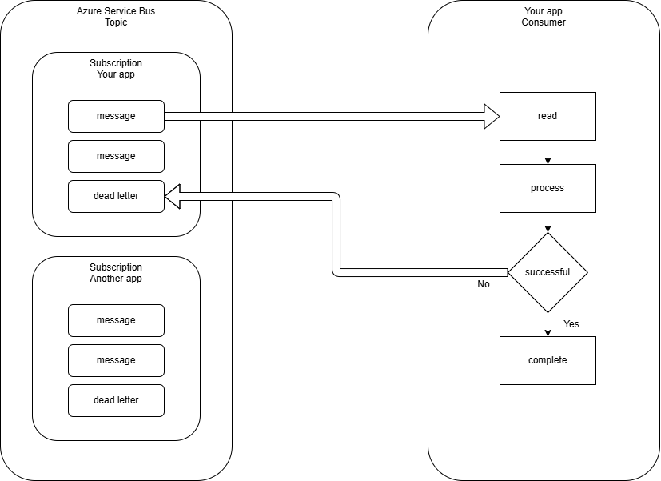

# Messaging inbox standards

- Version: 0.1 (draft)
- Last reviewed: 21st July 2026

## General information

- these instructions are focused on inbox standards
- follow [C# instructions](csharp.instructions.md) for C# standards
- follow [C# unit test instructions](csharp-unit-test.instructions.md) for testing standards
- using [Azure Service Bus](https://learn.microsoft.com/en-us/azure/service-bus-messaging/service-bus-messaging-overview) for messaging
- inbox patterns are not new, so existing industry standards and best practices apply

## Consumer interface

- `IInboxConsumer` is the standard interface for inbox message handling
- all inbox consumers must implement this interface
- the interface gives `InboxWorker` a uniform way to discover:
  - the contract name
  - topic name
  - processor options
  - message handler
  - error handler

## Creating a new consumer

- create a new class implementing `IInboxConsumer`
- register the consumer in DI as a singleton
- process your message in the `HandleMessage` method
  - read the message
  - convert the message from JSON
  - call your service layer to perform the business operation
  - or store the message in an inbox table for later processing by a background service
  - mark the message as complete, dead-letter, or retry according to your business rules

When you need to call other services, use `IServiceScopeFactory` to create a scope and resolve your dependencies from that scope.

```csharp
public async Task HandleMessage(ProcessMessageEventArgs args)
{
  ...

  // InboxWorker and Consumers are singletons, so we have to create a scope for our services
  await using var scope = scopeFactory.CreateAsyncScope();
  IYourService yourService = scope.ServiceProvider.GetRequiredService<IYourService>();
  var result = await yourService.Update(message.Reference, RecordStatusIds.ActionNeeded, args.CancellationToken);

  ...
}
```

## Message handling flow (recommended)

1. read the message from the subscription
1. deserialise payload with known serializer options
1. process message using business logic
1. successful business result -> complete message
1. business failure result -> dead-letter message with reason
1. unexpected exception -> log error -> dead-letter or retry
1. never swallow exceptions, always log and settle the message



*example flow between subscription and consumer*

## Industry messaging features (recommended baseline)

- **Handle duplicate messages safely**  
  Design consumers so the same message can be received more than once without causing bad data.
- **Have a clear dead-letter approach**  
  When a message cannot be processed, dead-letter it with a clear reason and enough detail for support teams to investigate.
- **Retry temporary failures**  
  Retry short-lived problems (for example network or dependency issues), but stop after a sensible limit.
- **Set safe concurrency levels**  
  Start with a conservative `MaxConcurrentCalls`, then increase only when behaviour is stable and measured.
- **Respect message lock timing**  
  Keep processing within lock time, or use lock renewal where needed to avoid duplicate processing.
- **Make operations observable**  
  Use structured logs, tracing, and simple metrics (processed, failed, retried, dead-lettered).
- **Keep message contracts compatible**  
  Evolve contracts in a backward-compatible way so older and newer services can run together safely.

## InboxWorker background service

- `InboxWorker` is a background service that runs in your app and manages all inbox consumers
- it discovers all registered `IInboxConsumer` implementations and starts a message processor for each one
- it handles message processing, error handling, and logging for all consumers
- it is a singleton service, so it should not have any state or dependencies that are not thread-safe

## Testing inbox

For every consumer, include unit tests for:

- valid message -> business action executes and message completes
- null/invalid payload -> dead-letter with expected reason
- business failure result -> dead-letter with detail
- unexpected exception -> error logged and settled per policy
- mock or substitute dependencies to avoid calling real services or databases

## Future work / To be decided

- standards for message contract versioning and schema evolution.
- standards for error handling and retry policies.
- expand `IInboxConsumer` to work with both topics and queues.
